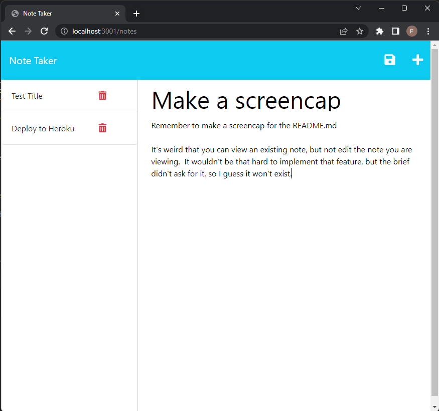

# Note Taker

A note-taking application, designed with to-do lists in mind.

## A Screencap of the Note Taker in a Normalized Chrome Window

## Usage Instructions

Follow this link:

[Inglehart Note Taker](https://module-eleven-challenge.herokuapp.com/)

Clicking the plus icon will make a new note: click on the title field to write a title; click on the text field to write text.

Clicking the save icon will save the content of a note.

In the left panel, clicking the title of a note will display that note in the right panel.

The red trashcan icon will delete that note.

## Future development

Good things to implement include:

* some kind of confirmation window (a prompt or a modal) to prevent notes from getting deleted on accident

* the ability to edit existing notes

* automatically assign each note a timestamp; display the time and date the note was created